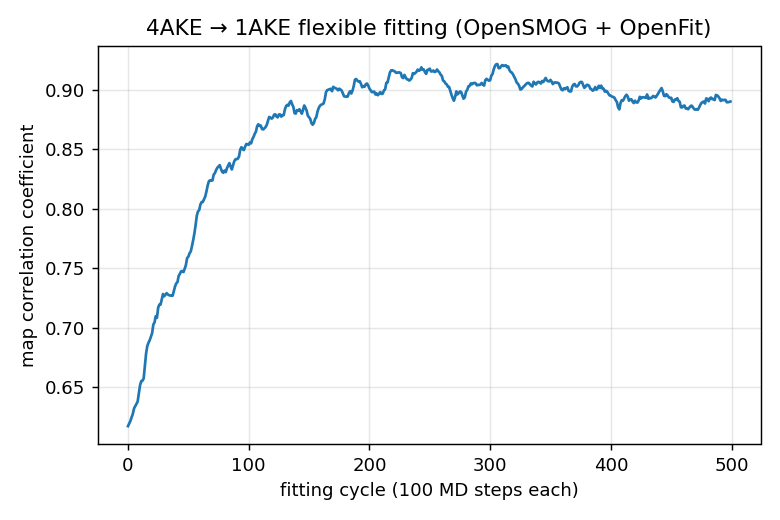

# Flexible fitting of adenylate kinase (4AKE → 1AKE)

A concrete, end-to-end example combining an **OpenSMOG** structure-based model
with the **OpenFit** density-correlation force.

Adenylate kinase (AdK) undergoes a large open→closed hinge motion. Here the
*open* structure (PDB **4AKE**) is flexibly fitted into the density of the
*closed* structure (PDB **1AKE**). The SMOG (Gō-like) force field keeps the
protein stereochemically sensible while OpenFit pulls the atoms toward higher
correlation with the target map. OpenFit's force is a tabulated per-atom
gradient refreshed every few MD steps via `Fit.update_force` — no OpenMM
`Context` rebuild.

## Requirements

```bash
pip install OpenSMOG "openfit[openmm,io]"
```

## Files

| File | Role |
| --- | --- |
| `4ake.AA.gro` / `.top` / `.xml` | SMOG 2 all-atom structure-based model of open AdK (1656 atoms) |
| `1AKE.mrc` | target density (closed AdK), 75³ voxels @ 2 Å |
| `4ake.pdb` | reference open structure |
| `run_fit.py` | the driver script |
| `initial.mrc` / `final.mrc` | simulated density before / after fitting |
| `4ake_fitting_trajectory.dcd` | the open→closed fitting pathway |
| `correlation_history.txt` / `correlation.png` | correlation coefficient per cycle |

## Running

```bash
python run_fit.py                          # 500 fitting cycles on CPU (~minutes)
python run_fit.py --fitting-iterations 100 # shorter
python run_fit.py --platform CUDA          # if an OpenMM CUDA platform is available
```

The script: builds the SMOG system, loads `1AKE.mrc` as the target and adds the
OpenFit force, removes the COM-motion remover (so the force can translate the
protein), equilibrates briefly, then alternates `update_force` with short MD
runs, saving `initial.mrc`/`final.mrc` and the correlation history.

## Result

The map correlation rises from **~0.62** to **~0.89** (peaking ~0.92) as the open
conformation collapses into the closed-state density:



These artifacts were produced by the run in `../4ake_scratch/` (a throwaway
working directory, not version-controlled). Re-running `run_fit.py` regenerates
them.
